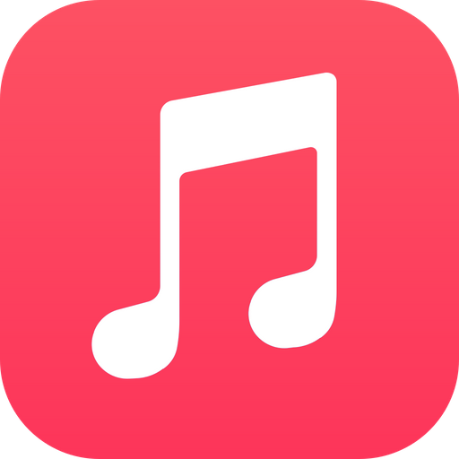
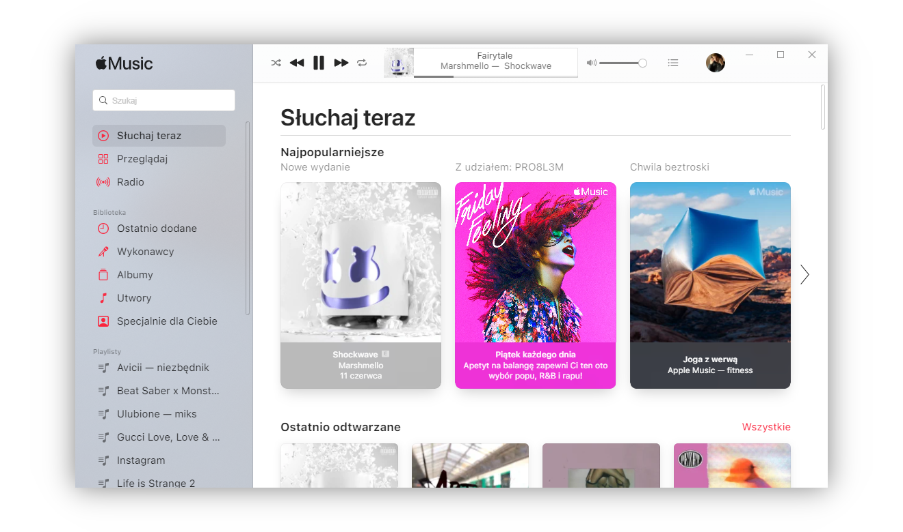

# Apple Music for Windows

   

Electron-powered Apple Music app for Windows, made in 6 hours.  
I know, it's Electron. But hey, at least it's not iTunes - let's think this way.

_UI will be in your Apple ID language, mine is Polish._

## Featuring

- Slightly windowsified UI inspired by UWP (e.g. acrylic sidebar)
- Widevine CDM for all your Apple Music DRM protected tracks
- Frameless design with custom CSS and some minor QoL changes
- Windows dark theme support
- Still a bit choppy interface, but works better than iTunes in most cases

## What doesn't work

- Dolby Atmos playback, because it's not supported on the web version of Apple Music
- Other more advanced features like streaming to an AirPlay device

## Known issues

- While the dark mode works, switching between Windows themes when the app is open causes a visual glitch connected with the acrylic sidebar - a fix for this should be fairy simple, but I didn't have enough motivation to do that 😛
- From time to time you may encounter an error presented in a form of Apple-style alert - in that case it's probably Apple's fault - before submitting a bug report please check if you can reproduce it using the official Apple Music web app

## License

This project is licensed under the MIT License.

## Notice of Non-Affiliation and Disclaimer

This project is not affiliated, associated, authorized, endorsed by, or in any way officially connected with Apple Inc. or any of its subsidiaries or its affiliates.

Apple and Apple Music are trademarks of Apple Inc., registered in the U.S. and other countries and regions. All other trademarks are the property of their respective owners.
